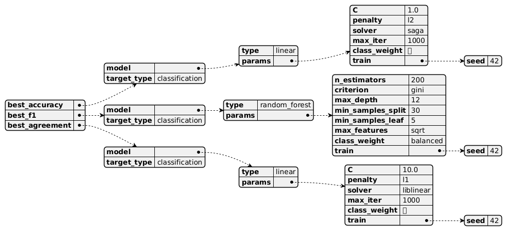

# DIET COKE: Decision trees Interpreting Efficient Transformers - Compression Of Knowledge Extraction

> **D**ecision trees **I**nterpreting **E**fficient **T**ransformers - **C**ompression **O**f **K**nowledge **E**xtraction

This repository implements a knowledge distillation pipeline that transfers knowledge from a fine-tuned BERT model (teacher) to a lightweight Decision Tree (student) for sentiment classification on the IMDB dataset.

## Why Distillation?

While large language models like BERT achieve excellent performance, they:
- Are computationally expensive (inference time)
- Have high memory requirements
- Are not easily interpretable

Decision trees address these limitations by providing:
- Fast inference
- Low memory footprint
- Interpretable decisions

## Quick Start

```bash
# Clone repository
git clone https://github.com/velocitatem/diet-coke
cd diet-coke

# Set up virtual environment and install dependencies
./scripts/setup_env.sh

# Activate virtual environment
source venv/bin/activate

# Fine-tune BERT teacher model
python src/train_teacher.py

# Distill knowledge to Decision Tree
python src/distill_to_tree.py

# Evaluate both models
python src/evaluate.py
```

## Methodology

1. **Teacher model**: Fine-tune BERT on IMDB sentiment classification
2. **Feature extraction**: Convert text to TF-IDF features
3. **Distillation**: Train Decision Tree on TF-IDF features to match BERT's soft predictions
4. **Evaluation**: Compare accuracy, interpretability, and inference speed

## Best Model Configurations

Our experiments revealed the following optimal configurations for different model types:

### Linear Model
```yaml
model:
  type: linear
  params:
    C: 1.0
    penalty: l2
    solver: saga
    max_iter: 1000
    class_weight: null
  seed: 42
```

### Random Forest
```yaml
model:
  type: random_forest
  params:
    n_estimators: 200
    criterion: gini
    max_depth: 12
    min_samples_split: 30
    min_samples_leaf: 5
    max_features: sqrt
    class_weight: balanced
  seed: 42
```

### Liblinear Model
```yaml
model:
  type: linear
  params:
    C: 10.0
    penalty: l1
    solver: liblinear
    max_iter: 1000
    class_weight: null
  seed: 42
```



## Configuration

Configurations are managed with Hydra. Override any parameter like this:

```bash
# Change distillation temperature
python src/distill_to_tree.py distill.T=4 distill.alpha=0.3

# Use a smaller subset of training data
python src/train_teacher.py data.dataset.n_train=1000
```

## Results

Check the TensorBoard logs for detailed metrics:

```bash
tensorboard --logdir outputs/
```

## Performance Metrics

The distillation process is evaluated using multiple metrics:
- Accuracy
- F1 Score
- Model Agreement with Teacher

These metrics are tracked during training and can be visualized using TensorBoard. 